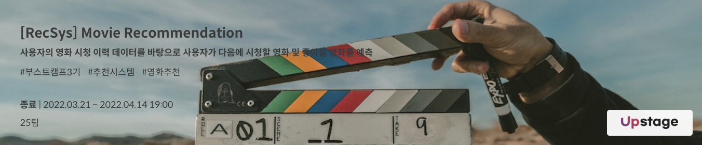
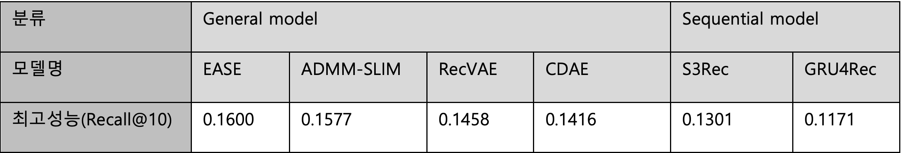
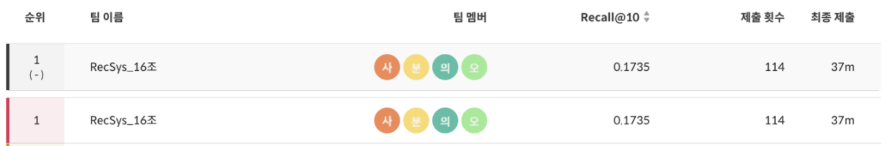

# RecSys16(사분의 오) Movie Recommendation

## 프로젝트 소개
### 개요
MovieLens 데이터의 일부(31360 users, 6807 items, 5154471 interactions)를 활용, 사용자의 영화 시청 이력 데이터를 바탕
으로 사용자가 다음에 시청할 영화와 시청했던 영화 중 일부를 예측했다.
유저의 영화에 대한 평가 여부(implicit feedback)와 영화(아이템)에 대한 정보(title, year, genre, director, writer)가 주어졌으
며, timestamp기반의sequential recommendation 시나리오에서 일부 item이 누락된(dropout) 상황을 가정하여 단순히 마지
막 item만을 예측하는 문제보다 복잡하고 실제와 비슷한 상황을 가정했다.

### 모델
#### 제공된 baseline 코드와 함께 RecBole 라이브러리 사용
제공된 baseline 코드와 [RecBole 라이브러리](https://github.com/RUCAIBox/RecBole)를 활용, CF, Autoencoder기반의 모델과 S3Rec, GRU4Rec, Bert4Rec 등
sequential 모델을 포함해 총 37종류의 모델을 학습시키고, 결과를 제출하였다.

### 모델 성능 정리

모델 성능을 비교 분석해보며 얻은 결론은 크게 2가지였다. 첫번째는 sequential model보다 general model이 전체적으로
좋은 성능을 보여준다는 점이었다. Sequential model은 유저가 이전에 본 영화 리스트를 바탕으로 다음에 볼 영화를 예측
하는 모델이다. 이러한 점 때문에 유저가 중간에 본 영화에 대해서 예측을 하기 어려웠고, 결과적으로 general model의
추천 결과가 더 좋은 성능 점수를 보여주었다고 분석했다. 두번째는 딥러닝 기반이 아닌 모델이 좋은 성능을 보여준다는
점이었다. 단일 모델로 제일 좋은 성능을 보여준 모델은 hidden layer도 없는 linear model인 EASE(Embarrassingly
Shallow Autoencoders)였다. 이외에도 EASE를 발전시킨 ADMM-SLIM과 SLIMElastic도 꽤 좋은 성능(recall@10: 0.1300)을
보여주었다. 이를 통해 추천 시스템에서는 꼭 딥러닝 모델을 쓰는 것이 아닌 데이터에 따라 적절한 모델을 사용하는 것이
중요하다는 점을 알 수 있었다

## 팀 역할
|  |  |  |  |
|:----------------------------------------------------------------------------------------------:|:----------------------------------------------------------------------------------------------:|:-------------------------------------------------------------------------------------------------:|:---------------------------------------------------------------------------------------------:|
|                             [ 구창회 ](https://github.com/sonyak-ku)                              |                             [ 김지원 ](https://github.com/Jiwon1729)                              |                              [ 전민규 ](https://github.com/alsrb0607)                             |                              [ 정준우 ](https://github.com/ler0n)                             |
|                             RankFM, 모델 앙상블                              |                        BPR ,앙상블                        |                               S3Rec, WandB&Sweep                             |                                 Recbole, inference                                

## 최종 순위 및 결과

|리더보드| Recall@10 |   순위   |
|:--------:|:---------:|:------:|
|public|  0.1878   | **1등** |
|private|  0.1735   | **1등** |

